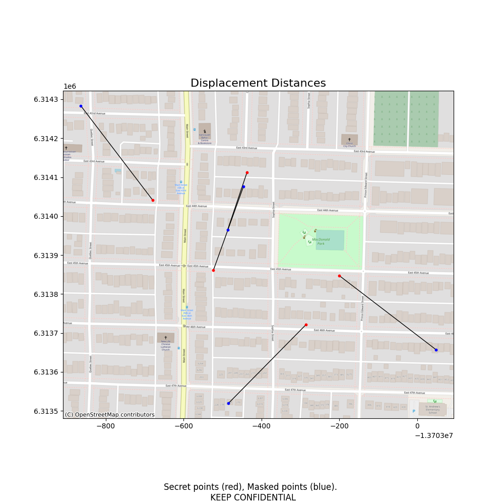

<div style="text-align:center; width: 100%;"></div>

-----


[](https://pypi.org/project/maskmypy/)

# MaskMyPy
## Key Features

- Python tools for anonymizing geographic point data held in GeoDataFrames.
- Includes three approaches towards donut masking.
- Includes a new OpenStreetMap-based approach called street masking.
- Evaluation tools for assessing displacement distance & spatial k-anonymity.
- A command line interface (CLI) for quick masking jobs.
## Introduction

[MaskMyPy](https://github.com/TheTinHat/MaskMyPy) is a Python package that performs geographic masking on [GeoDataFrames](http://geopandas.org/data_structures.html). In other words, it helps with anonymizing point data, such as confidential home addresses. It currently offers two main approaches towards anonymization: [donut masking](donut.md) and [street masking](street.md).

MaskMyPy also [includes evaluation tools](tools.md) to help optimize and validate masking parameters. These include k-anonymity estimation using population data, k-anonymity calculation using address data, and displacement distance calculation between secret and masked points.

### Use Cases: Why Geographic Masks?
Geographic masks are techniques that protect confidential point data while still maintaining important spatial patterns within the dataset. While aggregation is often employed for privacy protection (as done by many censuses), aggregation reduces the usefulness of the data for statistical analysis.  Example use cases for geographic masks include:

- A epidemiologist wants to release a dataset of patient addresses to help other researchers study the spread of a given disease. They also want anonymized points to remain inside the same census tract after masking to preserve statistical attributes. By utilizing donut masking and a containment layer, they are able to publish the dataset without compromising patient privacy, the location of important disease clusters, or census attributes.
- A mobile app developer wants to publish an end-of-year blog post with a map showing where their users have posted from, but is concerned about the privacy of their users. They utilize street masking to randomly displace points to nearby intersections on the street network before making the post.
- A criminologist wants to share a map of burglary locations but does not want to compromise victim privacy. They anonymize the dataset using street masking. To validate that their mask was effective they then calculate the spatial k-anonymity and displacement distance of each anonymized point. Realizing that some points were insufficiently protected, they tweak their masking parameters and repeat the process. Happy with the new results, they release the masked map.


### Disclaimer
*MaskMyPy is offered as-is, without warranty of any kind. Geographic masking is a hard problem that requires informed decisions and validation. MaskMyPy provides helpful tools for geographic masking, but does not replace expertise.*

## Installation
```shell
pip install maskmypy
```
To also install optional dependencies (such as those required for displacement mapping):
```shell
pip install maskmypy[extra]
```


## Usage

### Masking/Anonymization
The following snippet applies a 500 meter donut mask to a GeoDataFrame of secret (e.g. sensitive) points:

```python
>>> from maskmypy import Donut
>>> import geopandas as gpd
>>> secret = gpd.read_file('secret_points')
>>> secret.head()
     CID                           geometry
0      1  POINT (-13703523.337 6313860.932)
1      2  POINT (-13703436.959 6314112.457)
2      3  POINT (-13703679.041 6314040.923)
3      4  POINT (-13703285.553 6313721.356)
4      5  POINT (-13703200.338 6313847.431)

>>> masked_points = Donut(secret, min_distance=50, max_distance=500).run()

>>> masked_points.head()
     CID                           geometry
0      1  POINT (-13703383.941 6313989.161)
1      2  POINT (-13703227.863 6313973.121)
2      3  POINT (-13703313.001 6314172.582)
3      4  POINT (-13703107.232 6313614.978)
4      5  POINT (-13702837.385 6314140.874)
```

Unless specified, MaskMyPy uses the same units of distance as the CRS of the input secret points. If our secret points instead used a CRS that is in feet, then our mask would have had a maximum distance of 500 feet.


### Evaluation
We can also add some parameters to the [`.run()`](tools/#shortcut-evaluation-using-run) method to help us better evaluate our masking results. For instance, we can visually inspect the masking process by creating a rudimentary map of displacement distances like so:

```python
>>> masked_points = Donut(secret, min_distance=50, max_distance=500).run(map_displacement=True)
```



To more rigorously evaluate our results, we could add a *context layer* of address points and use it to calculate the k-anonymity of each masked point:

```python
>>> address_points = gpd.read_file('addresses.shp')
>>> masked_points = Donut(secret, min_distance=50, max_distance=500, address=address_points).run(calculate_k=True)

>>> masked_points.head()
     CID                           geometry  k_calc
0      1  POINT (-13703383.941 6313989.161)      19
1      2  POINT (-13703227.863 6313973.121)      15
2      3  POINT (-13703313.001 6314172.582)      43
3      4  POINT (-13703107.232 6313614.978)      23
4      5  POINT (-13702837.385 6314140.874)      51
```
Of course, there are also use cases for geographic masking that may not involve addresses at all. In such cases, one could load an alternative point-based population layer in as an 'address' and receive similar benefits.

For more information on what's available in the .run() method, see [here](tools/#shortcut-evaluation-using-run).


## Command Line Interface (CLI)

MaskMyPy also has a limited command line interface for quick jobs on shapefiles. The CLI contains commands for both donut and street masking classes (it does not support Donut_K or Donut_Multiply). Here's the command to street mask a input shapefile of points and save it as `masked_points.shp`:

```shell
maskmypy street --max-depth 25 secret_points.shp masked_points.shp
```

To find out more, just run `maskmypy --help`.

## Roadmap
The following features are currently planned:

- Location Swapping/Verified Neighbor masks
- Mask metadata export
- Data suppression tools

## Contribute
Any and all efforts to contribute are welcome, whether they include actual code or just feedback. In particular, I could use some help with:

- Architecture. Don't hesitate to point out things that look downright weird.
- Tests. A range of unit tests are already included for donut masking, but the street mask tests are currently a bit thin comparatively. The CLI could also use some tests.
- Documentation. Even just pointing out areas where you feel could use more documentation would be most helpful.

Developers, please keep the following in mind:

- You can install the necessary development tools by cloning the repo and running  `pip install -e .[develop]`.
- MaskMyPy uses `black` with a line length of 99 to format the codebase. Please run `black -l 99` before submitting any pull requests.
- Run `pytest` from the project root before submitting any code changes to ensure that your changes do not break anything.
- Please include any appropriate unit tests with any feature contributions.