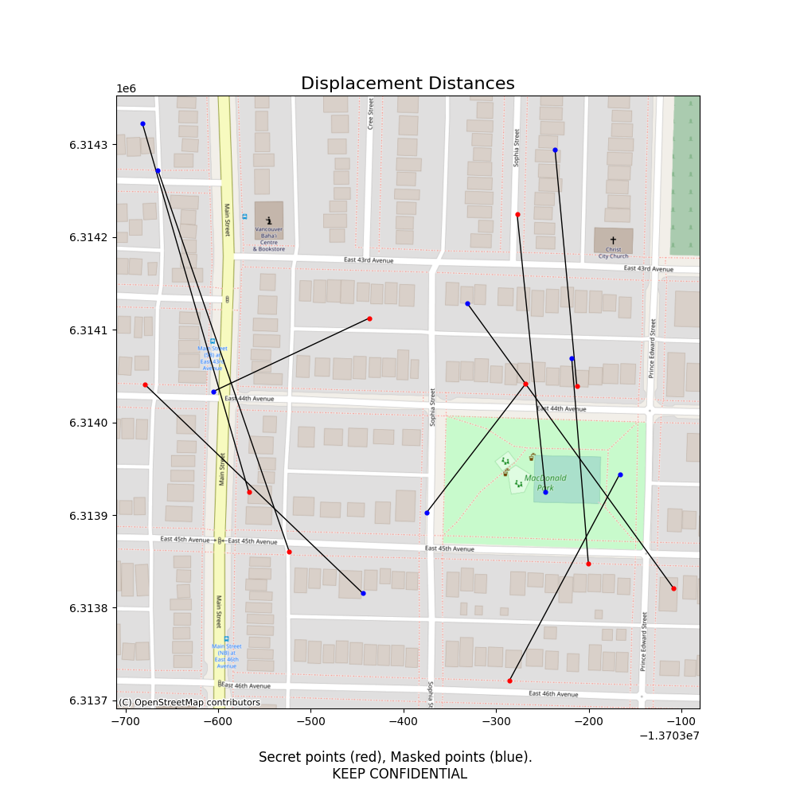

<div style="text-align:center; width: 100%;"></div>

-----

Python tools for anonymizing geographic data.


[](https://pypi.org/project/maskmypy/)

# Introduction

[MaskMyPy](https://github.com/TheTinHat/MaskMyPy) is a Python package that performs geographic masking on [GeoDataFrames](http://geopandas.org/data_structures.html). It offers two main methods: [donut masking](donut.md) and [street masking](street.md).


MaskMyPy also supports [calculating metrics](metrics.md) to help optimize and validate masking parameters. Currently, it offers k-anonymity estimation using population data, k-anonymity calculation using address data, and displacement distance calculation between sensitive and masked points.

**Disclaimer**: *MaskMyPy is offered as-is, without warranty of any kind. Geographic masking is a hard problem that requires informed decisions and validation. MaskMyPy provides helpful tools for geographic masking, but does not replace expertise.*

## Installation

```
pip install maskmypy
```

## Example

The following snippet applies a 500 meter* donut mask to a GeoDataFrame of sensitive (e.g. secret) points:

```python
>>> from maskmypy import Donut
>>> import geopandas as gpd
>>> secret = gpd.read_file('secret_points')
>>> secret.head()
     CID                           geometry
0      1  POINT (-13703523.337 6313860.932)
1      2  POINT (-13703436.959 6314112.457)
2      3  POINT (-13703679.041 6314040.923)
3      4  POINT (-13703285.553 6313721.356)
4      5  POINT (-13703200.338 6313847.431)

>>> masked_points = Donut(secret, max_distance=500).run()
>>> masked_points.head()
     CID                           geometry
0      1  POINT (-13703383.941 6313989.161)
1      2  POINT (-13703227.863 6313973.121)
2      3  POINT (-13703313.001 6314172.582)
3      4  POINT (-13703107.232 6313614.978)
4      5  POINT (-13702837.385 6314140.874)
```

Chaining a given masking class (in this case `Donut()`) to the `run()` method is a quick way to return a masked GeoDataFrame. Alternatively, we can store an instance of the masking class to start accessing more functionality, like calculating displacement distance:

```python
>>> donut = Donut(secret, max_distance=500) # Instantiate  the class
>>> donut.run() # Execute the masking procedure
>>> donut.displacement() # Add column containing displacement distance
>>> donut.mask.head() # Access the masked geodataframe from .mask
     CID                           geometry   _distance
0      1  POINT (-13703383.941 6313989.161)  189.404946
1      2  POINT (-13703227.863 6313973.121)  251.267943
2      3  POINT (-13703313.001 6314172.582)  388.997713
3      4  POINT (-13703107.232 6313614.978)  207.639785
4      5  POINT (-13702837.385 6314140.874)  466.738146
```

We can also create a quick map of the displacement distance so that we can visually inspect the masking process:
```python
>>> donut.map_displacement('assets/displacement_map.png')
```



\* *Note that the `max_distance` parameter assumes that the supplied distance is in the same unit as the GeoDataFrame. For example, if your GeoDataFrame is projected to a CRS that uses feet, then `max_distance=500` will displace points up to 500 feet.*

## Roadmap
The following features are currently planned:

- Location Swapping/Verified Neighbor masks
- Mask metadata export
- Minimum displacement values rather than ratios
