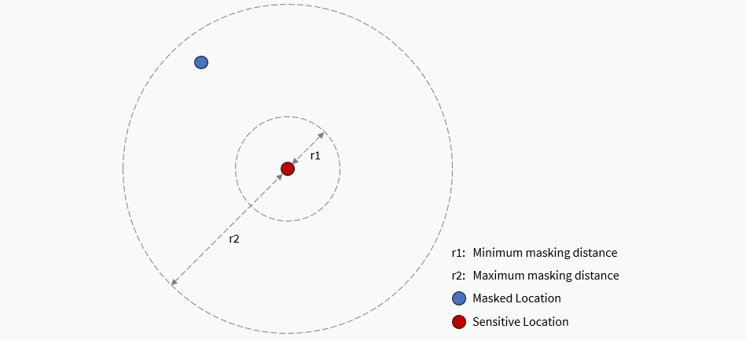
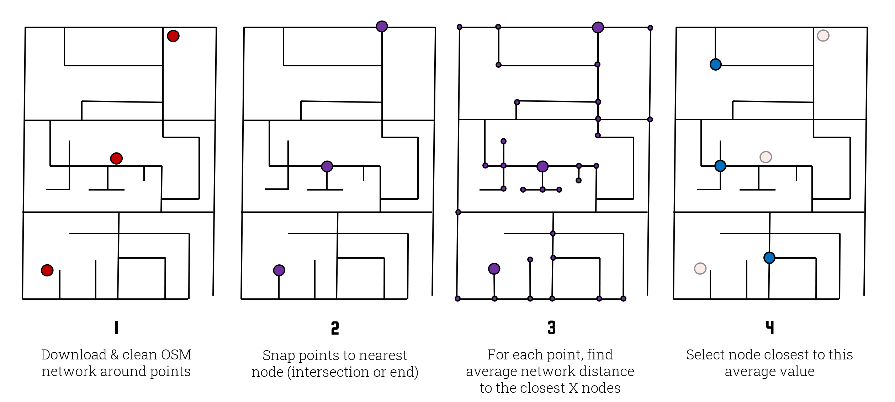

## Donut Masking

<!-- At its most basic, donut masking is an anonymization technique that works by randomly displacing each point between a specified minimum and maximum distance, as pictured below. This makes it a stronger form of random perturbation, which uses no minimum distance and thus runs the risk of insufficiently anonymizing points. MaskMyPy offers donut masking using the `maskmypy.donut()` masking function. -->
<!---->
<!--  -->

::: maskmypy.donut
    options:  
      show_root_heading: false
      show_root_toc_entry: false
      show_root_members_full_path: false

---

## Street Masking

<!-- Street masking automatically downloads OpenStreetMap data and uses it to geographically mask your secret points. It provides some of the advantages of population-based masks without requiring the user to hunt down any additional data. It works by first downloading the road network, snapping each secret point to the nearest node on the network (e.g. an intersection or dead end), and then calculating the average network-distance between that node and a pool of the closest _n_ nodes. Note that _n_ is randomly determined for each point from a specified range between `min_depth` and `max_depth`. This average distance is used as the target displacement distance. Finally, it selects a node from the pool whose network-distance from the starting node is closest to the target displacement distance. -->
<!---->
<!-- You can read more about street masking in [this peer reviewed article](https://ij-healthgeographics.biomedcentral.com/articles/10.1186/s12942-020-00219-z). -->
<!---->
<!--  -->
<!-- _(Note: this diagram is slightly dated as street masking now includes a randomization element. Specifically, depth values are now provided as a range within which a value is selected at random for each point. This makes it more difficult for an attacker to re-identify any given masked point.)_ -->

::: maskmypy.street
    options:  
      show_root_heading: false

--- 

## Location Swapping

::: maskmypy.locationswap
    options:  
      show_root_heading: false

--- 

## Voronoi Masking 

::: maskmypy.voronoi
    options:  
      show_root_heading: false

