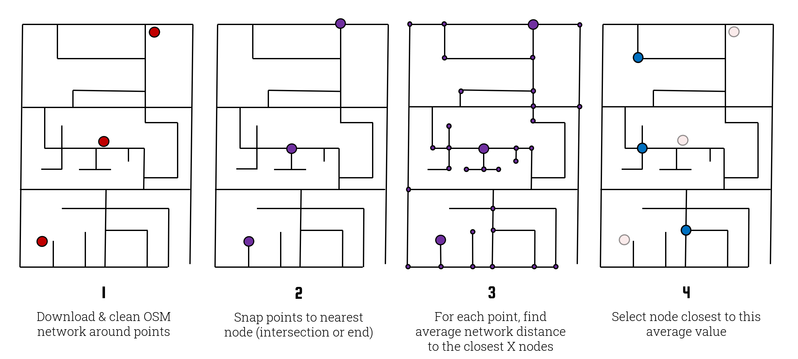

## What is Street Masking
Street masking automatically downloads OpenStreetMap data and uses it to geographically mask your secret points. It provides some of the advantages of population-based masks without requiring the user to hunt down any additional data. It works by first downloading the road network, snapping each secret point to the nearest node on the network (e.g. an intersection or dead end), and then calculating the average network-distance between that node and a pool of the closest *n* nodes. Note that *n* is randomly determined for each point from a specified range between `min_depth` and `max_depth`. This average distance is used as the target displacement distance. Finally, it selects a node from the pool whose network-distance from the starting node is closest to the target displacement distance.

You can read more about street masking in [this peer reviewed article](https://ij-healthgeographics.biomedcentral.com/articles/10.1186/s12942-020-00219-z).


*(Note: this diagram is slightly dated as street masking now includes a randomization element. Specifically, depth values are now provided as a range within which a value is selected at random for each point. This makes it more difficult for an attacker to re-identify any given masked point.)*

## Example Usage
To street mask a GeoDataFrame containing secret points with a search-depth range of 20-30 nodes into the street network:

```python
from maskmypy import Street

streetmask = Street(
    secret=my_secret_gdf, # Name of the secret GeoDataFrame.
    min_depth=20, # The minimum depth into the street network that will be traversed.
    max_depth=30, # The maximum depth into the street network that will be traversed.
    seed=12957134581, # A seed value to ensure reproducible results.
    address=address_points_gdf) # Layer of address points used in the next line to calculate k-anonymity.


streetmask.run(calculate_k=true) # Execute the mask and add a column describing the k-anonymity of each point.

masked = streetmask.mask
```

## Reference

<div class="func-heading">maskmypy.Street(secret)</div>
::: maskmypy.Street